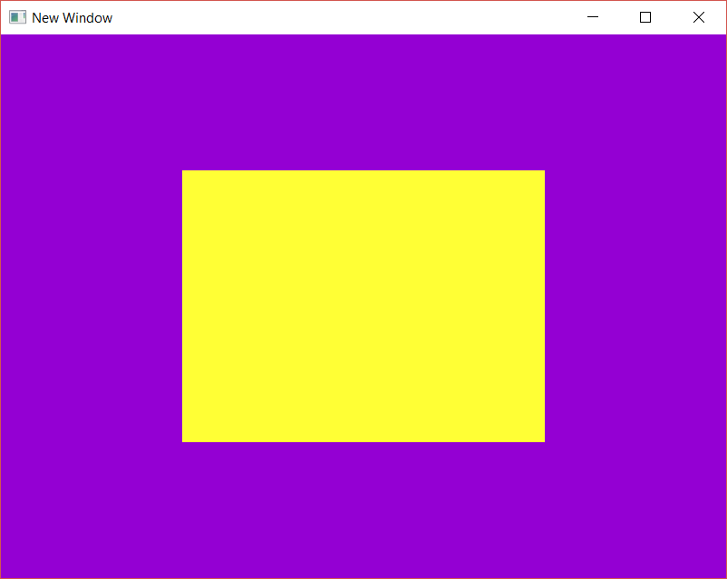

# AG_02
The goal was to create a quad from two triangles.

** Introduced in this activity**: Intro to the OpenGL pipeline, vertex shader, fragment shader, element buffer object, and vertex array.

Progress tracked in issue #2.

