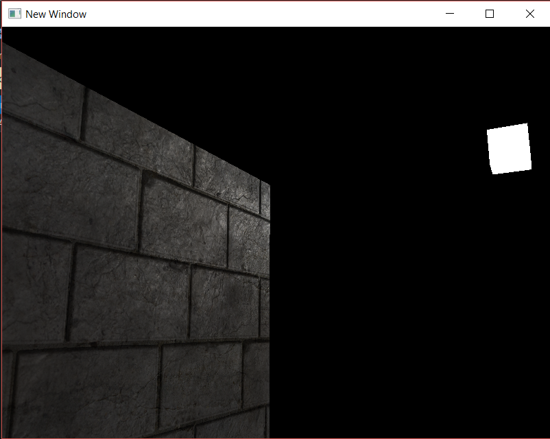

# AG_07_02
The objective was to learn how to apply diffuse and specular textures in materials, using the scene from the previous project (AG_07_01).

**Introduced/reviewed in this activity**:  Materials, diffuse and specular, review of texture coordinates.

Progress tracked in issue #30.

