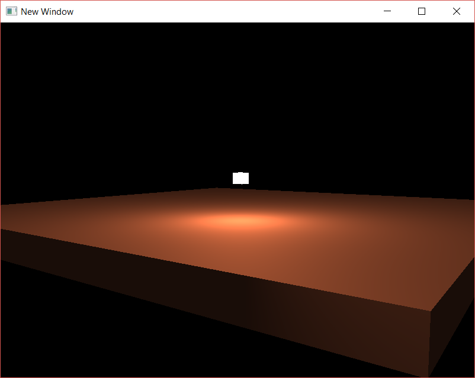

# AG_08_01

In this activity, we replaced the Phong lighting with the Blinn-Phong model, to address specular reflection issues that occur when the shininess is low. We set up a scene similar to that of AG_06, but decreasing the shininess to notice the difference in the reflection.

**Introduced/reviewed in this activity**: learned about issues with the Phong lighting model, and were introduced to the Blinn-Phong model and how to implement it by changing the calculations in the fragment shader.

Progress tracked in issue #31.

