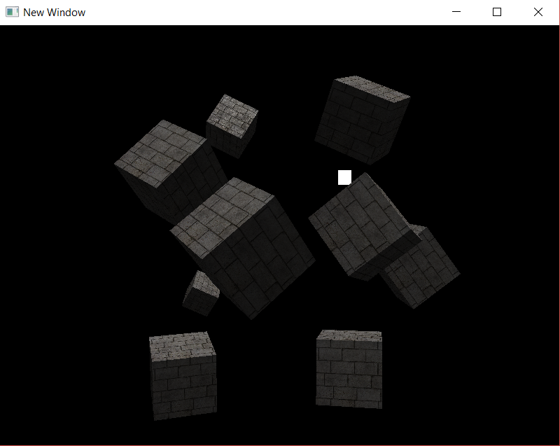

# AG_08_02

In this activity, we created a scene with multiple cubes, applying a directional light caster and adjusting the fragment shader, taking AG_07_02 as the base for the project.

**Introduced/reviewed in this activity**: difference between a simple light as seen before, and a directional light that covers everything in the scene.

Progress tracked in issue #31.

