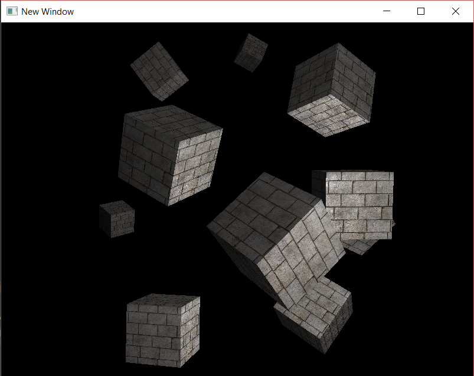

# AG_08_05

In this activity, we wanted to create a scene with multiple lights. We added 1 directional light and 2 point lights, in a new project based on AG_08_04.

**Introduced/reviewed in this activity**: how to use more than one light in the scene by combining their values in the fragment shader.

Progress tracked in issue #31.

