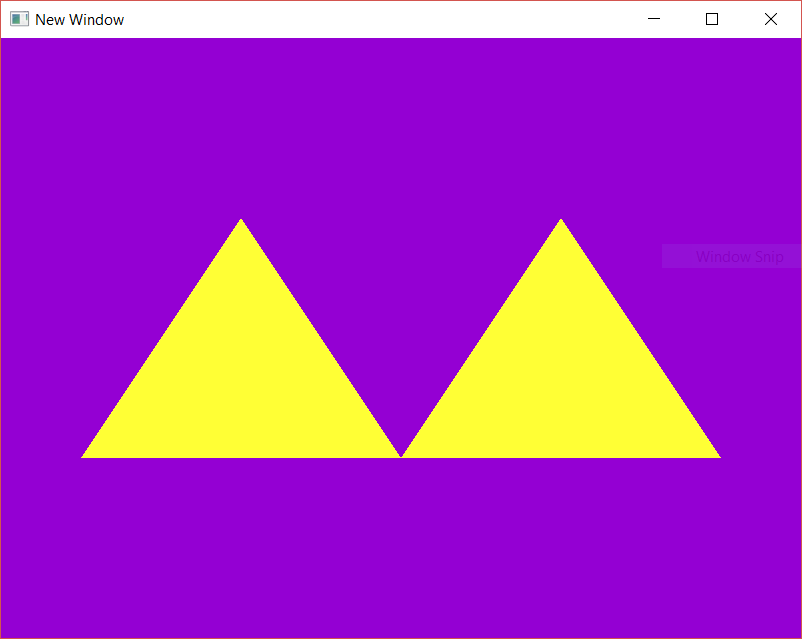

# EJ_02_01
The goal was to create two triangles in the form of " /\/\ " without indexed drawing, adding more vertices to the vertex array and calling glDrawArrays.

**Reviewed in this exercise**: drawing only with a VBO, no EBO

Progress tracked in issue #6.

