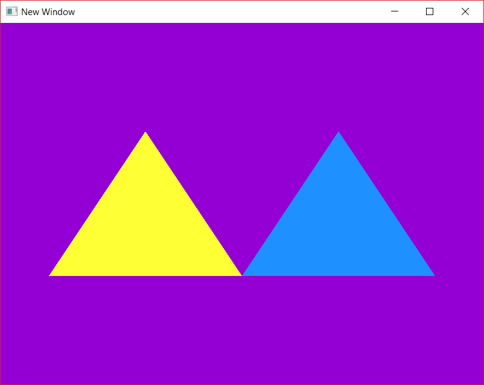

# EJ_02_04
Draw the two triangles from previous EJ_02 exercises, but each in a different color. Use different fragment shaders for each, but the same vertex shader. To achieve this, two different programs need to be created. Also, each triangle will be in its own VAO. No EBO is needed in this case.

**Reviewed in this exercise**: use of shader programs

Progress tracked in issue #9.

