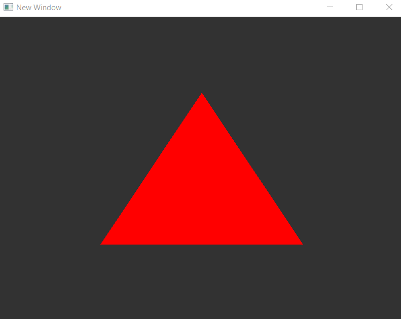

# EJ_03_02
The goal was to change the triangle's color over time, using glfwGetTime().

**Introduced/reviewed in this activity**: glfwGetTime(), simple animation. Use of uniforms.

Progress tracked in issue #17.

