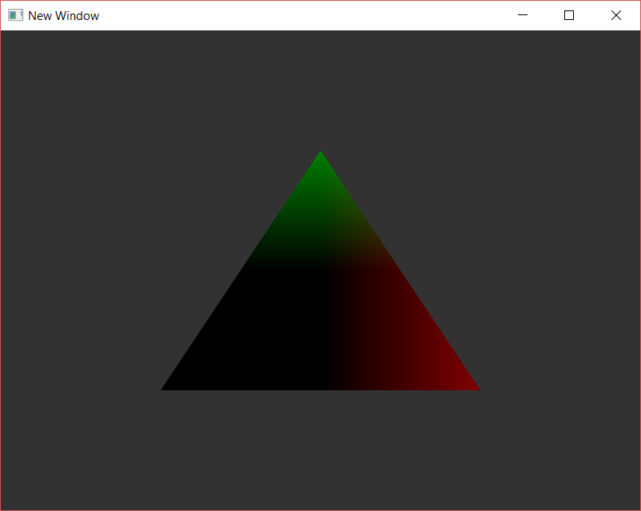

# EJ_03_04
The objective was to pass the vertex position data to the fragment shader and set the color with this data, and analyze what happens, understand how it interpolates.

**Introduced in this activity**: Review of fragment shaders, shader ins and outs, color interpolation.

**Discussion:** *How does the interpolation work in this case?*
If we look at the triangle, its bottom left side is black, up until the middle. Now, if we analyze the coordinates for that bottom left vertex, we know x=-0.5 and y=-0.5. Thinking of the cartesian plane and its quadrants, we know that this position would fall in quadrant III, where the values in the x and y axes are all negative. But since we are using these values as colors, we also need to think: colors happen to be only within 0.0 and 1.0, **where 0.0 represents black, and anything less than 0.0 is clamped**. Therefore, our -0.5's are interpreted as black, and that is why the triangle is painted the way it is.

Progress tracked in issue #19.

